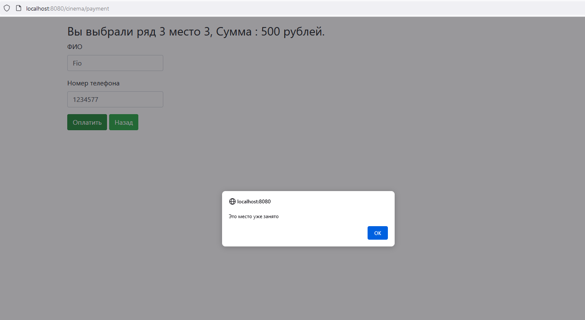

Проект Cinema из курса job4j. Сервис по бронированию билетов на киносеансы. Сервис позволяет зарезервировать место за определённым пользователем.

# Технологии
* Java 11
* Java EE Servlets
* PostgreSQL, JDBC
* Maven, Tomcat
* HTML, JavaScript, jQuery, JSON

# Установка 
1. Подключить tomcat 
2. Создать базу данных с таблицами из \src\db\schemas.sql
3. Внести данные БД в cinemaDb.properties и поместить его в папку tomcat/bin/